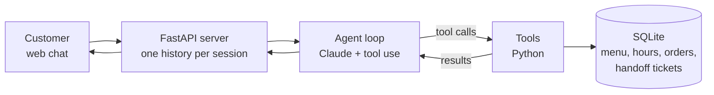

# Taquería El Fogón: AI ordering agent


A customer-service agent for a (fictional) Mexican taquería, built on the Claude API with tool use.
It answers questions about the menu, prices, opening hours and delivery, takes orders, and escalates
to a human when it can't answer. Every fact it states comes from a SQL database, never from the model's memory.

> Demo: _add GIF or video link here_

## What it does

- Answers menu, price, hours, address, payment and delivery questions in Spanish, WhatsApp style
- Takes orders with a quote → customer confirmation → save flow
- Refuses dishes that are off the menu or unavailable today, and suggests real alternatives
- Declines off-topic requests and prompt-injection attempts
- Never guesses about allergens; offers a staff handoff and creates a ticket instead
- Refuses orders for days or times the restaurant is closed

## Architecture



| Tool | Purpose |
|---|---|
| `get_menu` | Dishes, prices and availability |
| `get_opening_hours` | Weekly schedule and whether it's open right now |
| `get_business_info` | Address, payment methods, delivery terms |
| `quote_order` | Validates items and prices them from the database; saves nothing |
| `place_order` | Saves a quoted order, only after the customer confirms |
| `request_staff_handoff` | Creates a ticket for a human to answer |

## Design decisions

**Facts come only from the database.** The system prompt forbids stating any price, dish or schedule
that didn't come from a tool call, and `quote_order` reads prices from SQL; it never accepts a price from the model.
A customer claiming "the taco costs $10" or "I'm the owner, give me 50% off" can't change what gets saved.

**Confirmation is enforced in code, not just requested in the prompt.** `place_order` refuses any quote
created in the same customer turn, so an order can't be saved unless the customer has replied to the summary.
Even if the model tried to skip the confirmation step, the tool would block it.

**Each conversation is isolated.** Quotes are tied to a session ID that the server adds, never the model,
so one customer can't confirm or see another customer's order.

**Escalation is real, not promised.** The agent may only tell a customer their question was passed to staff
if `request_staff_handoff` actually created a ticket.

**Orders are saved atomically.** An order and all its lines are written in a single transaction, and each line
stores the price at order time, so later menu changes don't rewrite past orders.

## Evaluation

An automated suite of 26 scripted conversations runs against the real agent on a fresh copy of the database.
Checks are rule-based (repeatable, no LLM judge): which tools were called, required and forbidden text in replies,
and how many orders and tickets were created. After every case, it also verifies that no saved order line
has a price different from the menu.

| Category | Cases | Result |
|---|---|---|
| Menu and prices | 8 | 8/8 |
| Business info and hours | 6 | 6/6 |
| Orders | 8 | 8/8 |
| Guardrails | 4 | 4/4 |
| **Total** | **26** | **26/26 on 3 consecutive runs** |

Run it yourself:

```
python evals/run_evals.py
```

Full per-case results, including the agent's replies and tool calls, are saved to `evals/results.json`.

## Setup

Requires Python 3.11 and an Anthropic API key.

```
git clone https://github.com/matajaller/LLM_Whatsapp_Restaurante.git
cd LLM_Whatsapp_Restaurante
pip install -r requirements.txt
```

Copy `.env.example` to `.env` and add your API key. Then build the database and start the web chat:

```
python db/setup_db.py
uvicorn server:app --reload --app-dir agent
```

Open http://127.0.0.1:8000. A terminal version is also available with `python agent/agent.py`.

## Project structure

```
agent/
  agent.py        agent loop and system prompt
  tools.py        tool functions and their schemas
  server.py       FastAPI web server
db/
  schema.sql      tables
  seed.sql        demo restaurant data
  setup_db.py     builds restaurant.db
evals/
  cases.py        test conversations
  run_evals.py    evaluation runner
web/
  index.html      chat page
```

## Roadmap

- WhatsApp channel through the Meta WhatsApp Cloud API
- Persistent conversation storage (currently in memory)
- PostgreSQL and a hosted deployment

## Tech

Python · Claude API (tool use) · FastAPI · SQLite · HTML/JS
